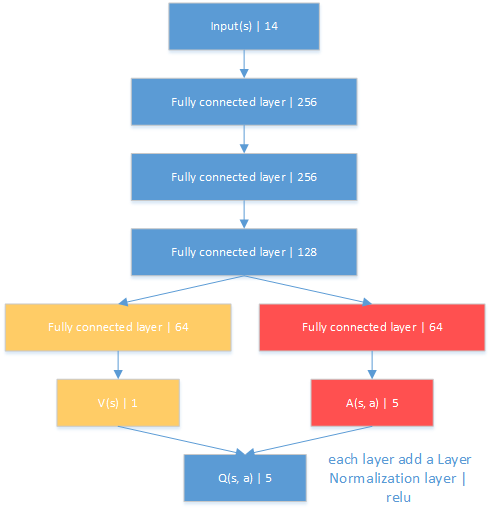
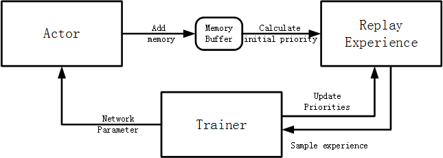
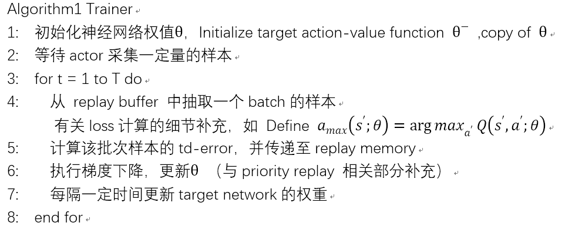
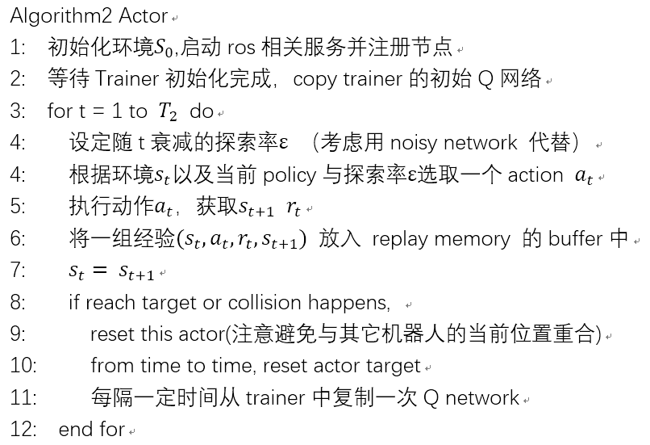
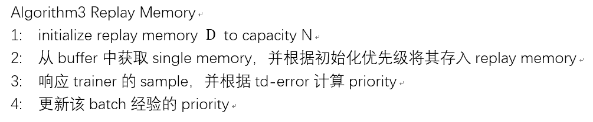

# 异步 RL 模型

**Asynchronous Off-Policy Deep Reinforcement Learning For Wheeled Robot Path Planning**

由于在真实环境中或 gazebo 仿真环境下（ROS的发布订阅模式），robot的控制命令需要控制在固定的频率下，以避免出现超出robot的实际物理限制的情况，而将Q network的优化过程、priority replay memory 的优先级更新等过程与robot的神经网络控制器前向传播过程结合在一起，会造成计算时间上的不确定性。此外, 由于robot的控制命令通常需要控制在较低的固定频率下，神经网络的优化将不得不限制在该频率下，这无疑是浪费时间的。一个直接的想法是将训练神经网络的步骤同智能体与环境交互的步骤分离.

一个Actor负责处理一个robot与环境交互的所有过程，每次交互得到的单个经验将发送至replay memory。Trainer 则从replay memory 中提取一个批次的memory，并在GPU上执行神经网络的优化过程。

尝试将原始DQN扩展成为Rainbow DQN, 改进包括：
1. Double Q-Learning 代码已实现，经典环境下运行正常;
2. Priority Replay Buffer 代码（异步版本）已实现, 正常;
3. Dueling DQN 网络结构已搭建，但由于网络与原论文网络上层差别较大，正确性有待检验;
4. Distributional DQN 未实现;
5. Noisy Network 运行不正确，需要进一步处理;
6. Multi-step Learning, 已实现:
   
 

前期实验中使用的Network Structure：

除了V(s)与A(s, a)结合为Q(s, a)层之外，所有层之间皆增加了Layer Normalization层，以减轻优化压力。激活函数为relu。

实验中的整体交互结构为:

#### Trainer/Acotr/MemPool算法

下面是Trainer/Acotr/MemPool的定义, 目前有关算法的计算细节没有写.

Actor, 主要负责与env交互并控制机器人的具体行为, 每隔一定时间时从Trainer上复制Q network, 至于每轮交互得到的经验是先放到buffer中一起发送给经验库, 还是每轮都发送, 则取决于具体实现:

Replay Buffer(非优先经验回放, 就不必计算priority):

考虑到现实世界中 pioneer3dx 的实际情况，gazebo仿真器中限制robot的移动速度最高为0.75 m/s , 每次action可选增加或减少0.05m/s，由于robot后部无测距手段，所以限制robot不可倒行；转向角速度最大为 0.5 rad/s，每次action可增加或减少0.05 rad/s。加上保持当前线速度、角速度的动作，共计5个action（可选结合型的动作？），而action的执行频率被限制在15HZ。
Laser的接收频率为20Hz，并从当前最近一次激光读数的10个特定角度上抽取一组数据，经过离散化处理，与机器人的当前位置坐标x、y，目标点坐标x、y共计14维向量作为状态。

#### 可能的扩展
每次可以将4个actor（robot）运行在同一个环境之下，每个robot都会将其它的robot当作动态障碍物，这体现动态环境之处（或者这是self play?）。机器人的初始位姿（所在位置、朝向）以及目标坐标都是随机的，以此期望actor可以学习到更通用的策略，而非针对特定场景，减轻过拟合。但这样一个动态环境，很有可能造成训练难以收敛，具有较大方差，没见过并行化训练、或者异步训练，将agent放在一起的（self play可能）。理论模型可能存疑，这不满足严格的定义。

#### Problem
机器人的定位问题，当前位置以及目标位置，需要额外的定位手段（室内高精度定位如wifi定位、ziBee定位等），可避免slam问题，因为是针对未知环境。在Tai L等人的工作中[1]，使用了ROS中自带的amcl（二维环境下的概率定位系统）作为定位手段，主要用以估计robot运行时与target的距离与角度，动态环境下位姿估计可能是不准确的。（实际这里的槽点不少，既然使用amcl说明是有地图数据的，作者说实体机器人运行时，用以协助定位，也就是没使用之前提的wifi定位等（为了简化实验））。

关于robot怎么停到target，一：将机器人角速度、线速度（离散化）作为状态数据输入，或许期望目标点的最终位姿（pose、v）可以一起作为期望学习到的能力，但有个问题，robot如何获取当前的朝向角（陀螺仪以及编码器是不可靠的）； 二：不设置robot到达目标地既reset并给予reward，而是最终停下，还是依靠speed，但speed与其它状态的输入向量间差别比较大，离散整数化后区别也很大，可能需要放缩？）